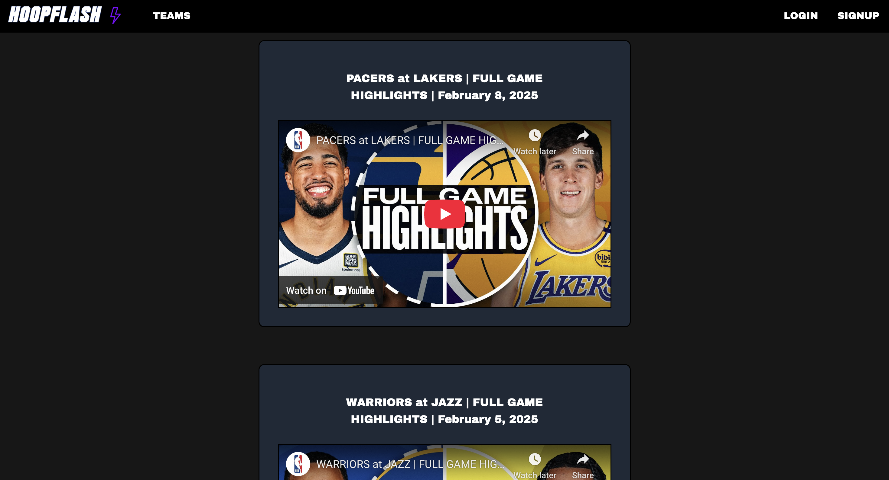
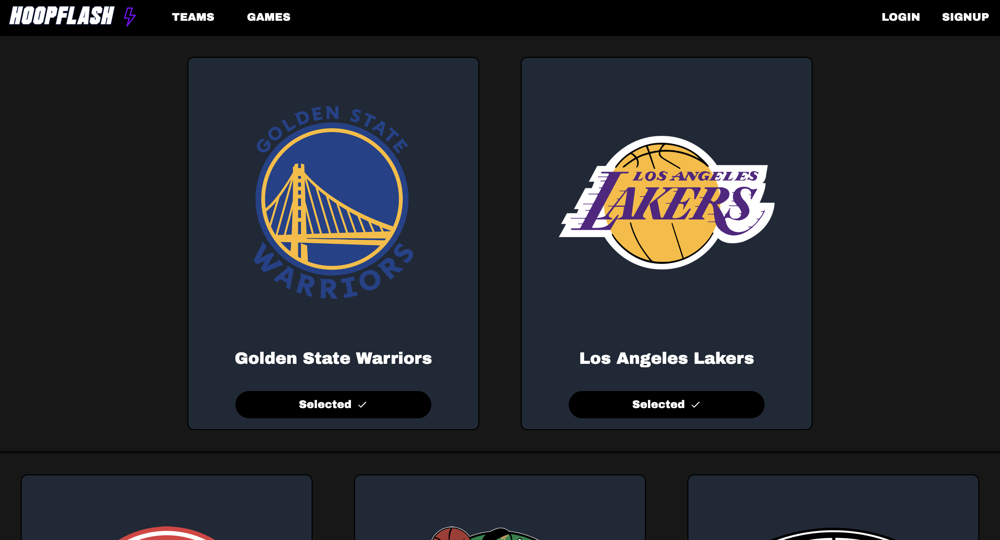
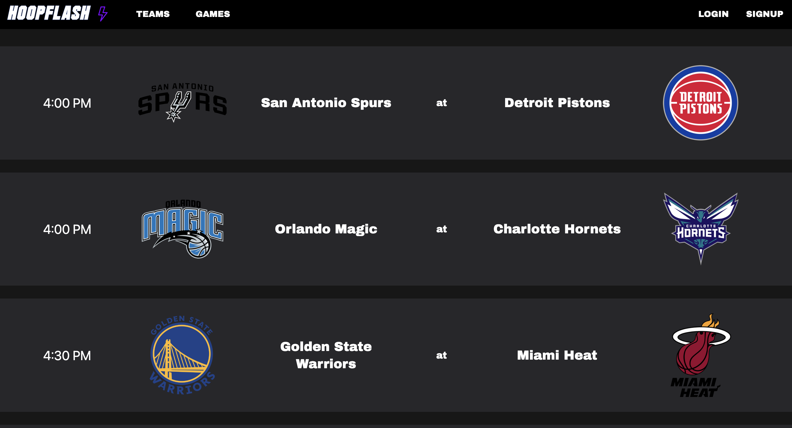

# NBA Highlights For The Teams You Actually Care About

This project is a sports website that displays NBA data.

### Live Site

You can access the live version of the site hosted on AWS S3 here: [HoopFlash](http://hoopflash-s3.s3-website.us-east-2.amazonaws.com/)

#### Features
- Highlights videos
- Teams selection
- Schedule of today's games







### Running the Project Locally

##### 1. Before running the project, install all necessary dependencies:
```
npm install
```

##### 2. Navigate to the client directory:
```
cd client
```
##### 3. Start the React application:
```
npm start
```

Your application should now be running locally.  
