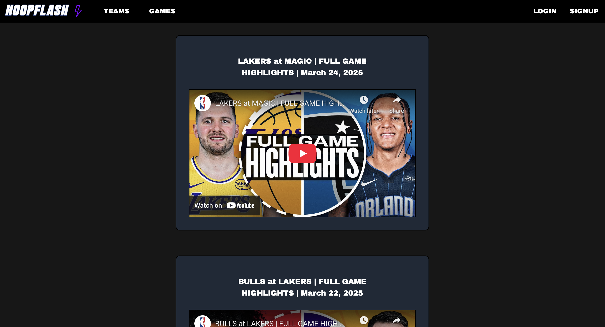

# NBA Highlights For The Teams You Actually Care About

This project is a sports website that displays NBA data.

### Live Site

You can access the live version of the site hosted on AWS S3 here: [HoopFlash](http://hoopflash-s3.s3-website.us-east-2.amazonaws.com/)

#### Features
- Highlights videos
- Teams selection
- Schedule of today's games




### Running the Project Locally

#### Install Dependencies

##### Before running the project, install all necessary dependencies:
```
npm install
```

#### Backend

##### 1. Navigate to the server directory:
```
cd server
```
##### 2. Start both the main server (API endpoints) and the authentication server:
```
npm start
```

#### Frontend

##### 1. Open a new terminal and navigate to the client directory:
```
cd client
```
##### 2. Start the React application:
```
npm start

```
Your application should now be running locally.  
